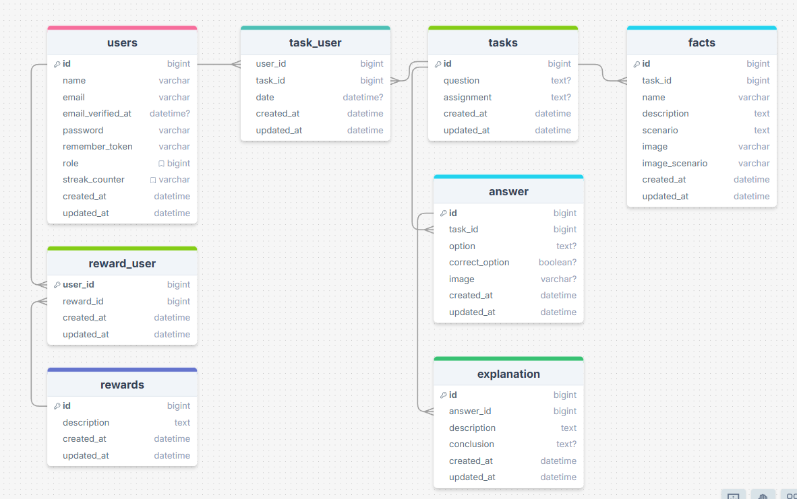

<div align="center">
  <a href="https://team5.hr-cmgt-tle2-laravel.nl/">
    
  </a>
 # Ecoreeks

  <p align="center">
    A web application that informs users about nature and the importance of biodiversity.
    <br/>
    <a href="https://team5.hr-cmgt-tle2-laravel.nl/"><strong>Open the application page on your web browser</strong></a>
    <br/>
  </p>
</div>
<br/>
<br/>
<details>
  <summary>Table of Contents</summary>
  <ol>
    <li>
      <a href="#about-the-project">About the Project</a>
      <ul>
        <li><a href="#built-with">Built With</a></li>
      </ul>
    </li>
    <li>
      <a href="#getting-started">Getting Started</a>
      <ul>
        <li><a href="#prerequisites">Prerequisites</a></li>
        <li><a href="#installation">Installation</a></li>
      </ul>
    </li>
    <li><a href="#usage">Usage</a></li>
    <li><a href="#contributing">Contributing</a></li>
  </ol>
</details>


## About the Project

Hier komt een variant van de pitch maar dan in het engels

### Built With:
*   [![Laravel][Laravel.com]][Laravel-url]
*   [![Tailwind][TailwindCSS.com]][Tailwind-url]
*   [![JavaScript][JavaScript.com]][JavaScript-url]

## Getting Started

To get a local copy up and running, follow the steps below.

### Prerequisites

Make sure you have the following software installed before you start:
*   **PHP:** Version 8.2 or higher.
*   **Composer:** For managing PHP dependencies. If you don't have Composer yet, follow the [Composer installation instructions](https://getcomposer.org/download/).
*   **Node.js and npm:** For managing front-end dependencies. Download this from the [official Node.js website](https://nodejs.org/).
*   **Git:** For version control. Download this from the [official Git website](https://git-scm.com/).

### Installation

1.  **Clone the repository**
    Open a terminal and navigate to the directory where you want to store the project. Then clone the repository with the following command:
    ```sh
    git clone https://github.com/HiddeBouwman/TLE2.git
    cd TLE2
    ```

2.  **Install PHP dependencies**
    Run the following command to install all necessary PHP packages:
    ```sh
    composer install
    ```

3.  **Install front-end dependencies**
    Install the necessary JavaScript packages with npm:
    ```sh
    npm install
    ```

4.  **Generate the application key**
    Every Laravel application needs a unique key to secure sessions and other encrypted data.
    ```sh
    php artisan key:generate
    ```

5.  **Run the database migrations and seeders**
    This command builds the database structure (tables and columns) and fills the database with initial data needed to use the application.
    ```sh
    php artisan migrate --seed
    ```

## Database logic
We've provided an ERD of how our database is structured.



<!-- USAGE EXAMPLES -->
## Usage

To start the development server:
```sh
php artisan serve
```

To compile and watch the front-end assets for changes:
```sh
npm run dev
```
The application is now available at `http://127.0.0.1:8000`.


See the [backlog](https://github.com/users/HiddeBouwman/projects/1) for a full list of proposed features (and known issues).

<!-- CONTRIBUTING -->
## Contributing

Contributions make the open-source community an amazing place to learn, inspire, and create. Any contributions you make are **greatly appreciated**.

If you have a suggestion to improve this project, please fork the repo and create a pull request. You can also simply open an issue with the tag "enhancement".
Don't forget to give the project a star! Thanks!

1.  Fork the Project
2.  Create your Feature Branch (`git checkout -b feature/AmazingFeature`)
3.  Commit your Changes (`git commit -m 'Add some AmazingFeature'`)
4.  Push to the Branch (`git push origin feature/AmazingFeature`)
5.  Open a Pull Request


<!-- MARKDOWN LINKS & IMAGES -->
[Laravel.com]: https://img.shields.io/badge/Laravel-FF2D20?style=for-the-badge&logo=laravel&logoColor=white
[Laravel-url]: https://laravel.com
[TailwindCSS.com]: https://img.shields.io/badge/Tailwind_CSS-38B2AC?style=for-the-badge&logo=tailwind-css&logoColor=white
[Tailwind-url]: https://tailwindcss.com
[JavaScript.com]: https://img.shields.io/badge/JavaScript-F7DF1E?style=for-the-badge&logo=javascript&logoColor=black
[JavaScript-url]: https://developer.mozilla.org/en-US/docs/Web/JavaScript
